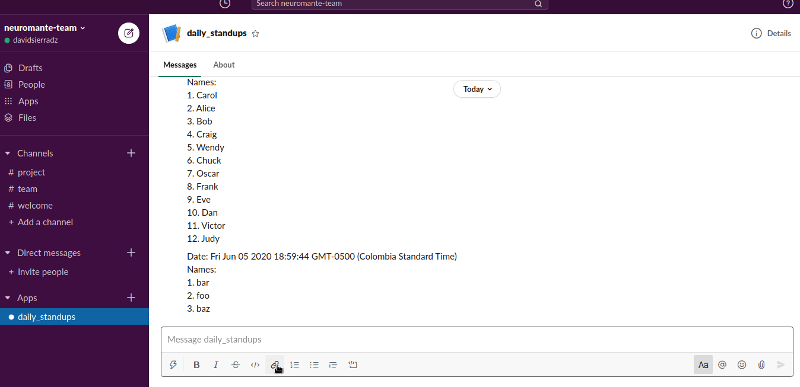

# slack-shuffle-bot-clojure

This is a clojure application written with [ring-clojure/ring: Clojure HTTP server abstraction](https://github.com/ring-clojure/ring/) that exposes a Slack command like `/shuffle alice bob carol` to randomize the string to a list:



## Requirements

You need clojure > 1.10

First, you need to create a [Slack App](https://api.slack.com/apps?new_app=1), configure a bot and a slash command and get a **Signing Secret**.

Copy or rename `.env.example` to `.env` and put the port and token in it, like:

```env
PORT=3000
SLACK_SIGNING_SECRET=XXXXXXXXXXXXXXXXXXXXXXXXXXXXXXXX
```

Don't forget to install your bot in some Slack workspace.

## Installation

1. Clone the repository: [slack-shuffle-bot-clojure](https://github.com/davidsierradz/slack-shuffle-bot-clojure)
2. Setup your secrets in `.env`
3. Run `clojure -P -M:project/run` (This will download all dependencies)

## Start

Just run `clojure -M:project/run`:

```console
$ clojure -M:project/run
> 2020-12-05 15:18:18.681:INFO::main: Logging initialized @1430ms to org.eclipse.jetty.util.log.StdErrLog
> 2020-12-05 15:18:21.817:INFO:oejs.Server:main: jetty-9.4.31.v20200723; built: 2020-07-23T17:57:36.812Z; git: 450ba27947e13e66baa8cd1ce7e85a4461cacc1d; jvm 11.0.8+10
> 2020-12-05 15:18:21.888:INFO:oejs.AbstractConnector:main: Started ServerConnector@15a8bbe5{HTTP/1.1, (http/1.1)}{0.0.0.0:3000}
> 2020-12-05 15:18:21.892:INFO:oejs.Server:main: Started @4641ms
```

## Development

Slack slash commands needs some URL to send the request, if you don't want to configure a server with a public IP, then use [ngrok - secure introspectable tunnels to localhost](https://ngrok.com/) to generate a public URL and expose your local instance of the server running.

## Deployment

### docker

1. First, build an image with: `docker build --tag=slack-shuffle-bot:latest .`
2. Run a container: `docker run --name=bot --env-file=.env --rm --interactive --init --tty --publish=3000:3000 slack-shuffle-bot:latest`

Don't forget to inject the `SLACK_SIGNING_SECRET` environment variable.

### nix

A Nix Flake exposes a Nix shell and a package to develop (with direnv) and consume the bot as a derivation:

```nix
systemd.services.slack-shuffle-bot = {
  enable = true;
  description = "This is a clojure application that exposes a Slack command like `/shuffle alice bob carol` to randomize the string to a list";
  after = ["network.target"];
  environment = {
    SLACK_SIGNING_SECRET = "XXXXXXXXXXXXXXXXXXXXXXXXXXXXXXXX";
  };
  serviceConfig = {
    Type = "simple";
    ExecStart = "${slack-shuffle-bot.packages.x86_64-linux.bot-clj}/bin/slack-shuffle-bot";
  };
  wantedBy = ["multi-user.target"];
};
```

## License

Copyright © 2022 David Sierra DiazGranados

Distributed under the Eclipse Public License either version 1.0.
